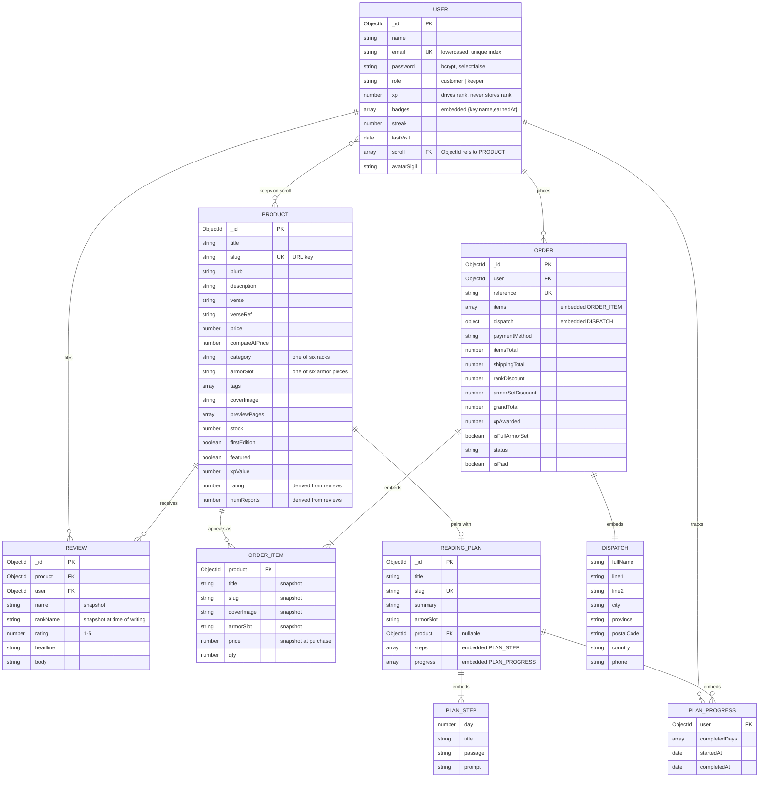

# Data model

MongoDB with Mongoose. Five collections. The design leans on embedding wherever
the embedded data is a point-in-time snapshot, and on references wherever the
related document must stay live.

## Entity relationship diagram

## Design decisions

### Order items are snapshots, not references

`ORDER_ITEM` copies the title, slug, cover image, armor slot and price at the
moment of purchase, alongside a reference to the product.

If it only stored the reference, then raising a price, renaming a title or
deleting a discontinued product would silently rewrite what a customer's past
orders say they bought and paid. An order is a historical record. It has to keep
saying what was true when it was placed.

The reference is kept as well, so "you have owned this before" and best-seller
aggregation still work.

### Rank is computed, never stored

`USER` stores `xp` and nothing else about rank. The rank itself is a Mongoose
virtual over `rankForXp(xp)`.

Storing both invites them to disagree. If the thresholds are ever retuned, every
stored rank instantly becomes wrong and needs a migration. Deriving it means the
new thresholds apply everywhere the moment they change.

### Reviews are their own collection, not embedded in products

Reviews are unbounded — a popular title could accumulate thousands — and
MongoDB documents cap at 16 MB. Embedding would also mean loading every review
on every product listing, when the listing only needs the average.

So `rating` and `numReports` are denormalised onto the product and recomputed by
an aggregation whenever a review is created or deleted. Reads are frequent,
writes are rare, so the denormalisation pays for itself.

A compound unique index on `{ product, user }` enforces one review per person
per title at the database level, not just in application code.

### `rankName` is snapshotted on reviews

A field report shows the rank the author held when they wrote it. That is a
statement about the past, so it does not update when they get promoted.

### Reading plan progress is embedded

Unlike reviews, progress is bounded by the number of users who started a
specific plan, and is only ever read in the context of that plan. Embedding
avoids a join for the common case.

This is the one model that would need rethinking at scale. With tens of
thousands of users on one plan, the progress array becomes the bottleneck and
should be split into its own collection.

## Indexes

| Collection | Index | Why |
|---|---|---|
| User | `email` unique | Login lookup, and stops duplicate registrations |
| Product | `slug` unique | Every product URL is a slug lookup |
| Product | text on `title, blurb, tags, author` | Powers the Scout search |
| Review | `{product, user}` unique compound | One report per person per title |
| ReadingPlan | `slug` unique | Plan URLs |

## Validation

Validation lives on the schema rather than in controllers, so it holds no matter
which code path writes the document — API request, seeder, or console.

- `email` must match an email pattern and is lowercased on write
- `password` has a minimum length and `select: false`, so it is never returned
  by an ordinary query
- `category`, `armorSlot`, `role`, `format` and `status` are all enums
- `price`, `stock` and `xp` have `min: 0`
- `items` on an order has a custom validator requiring at least one entry
- `rating` is bounded 1–5
